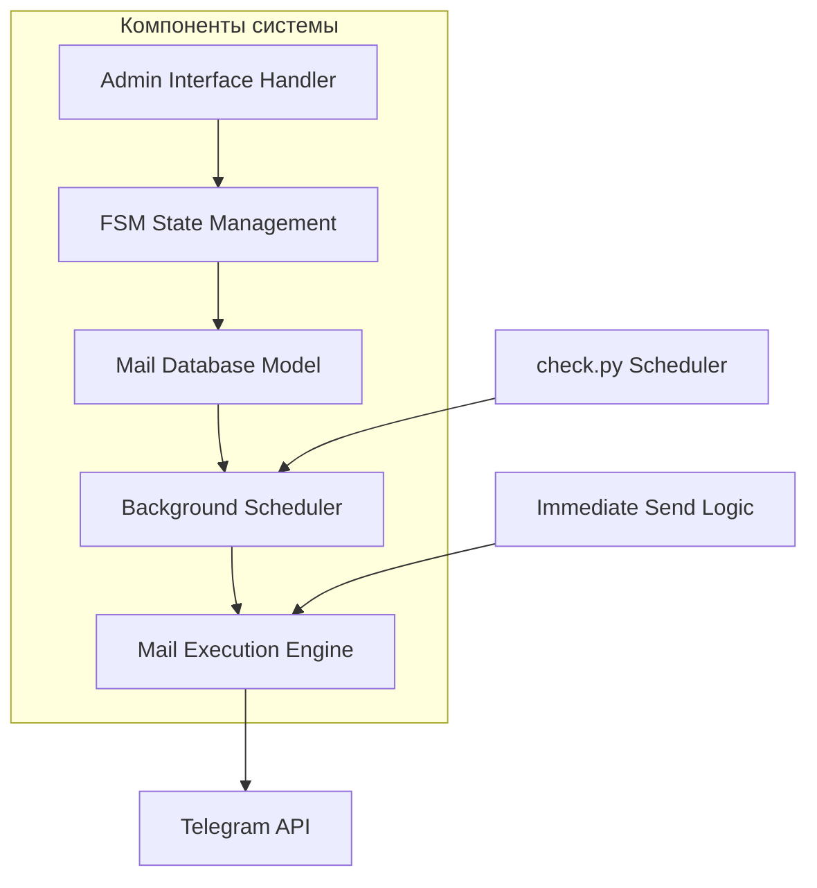
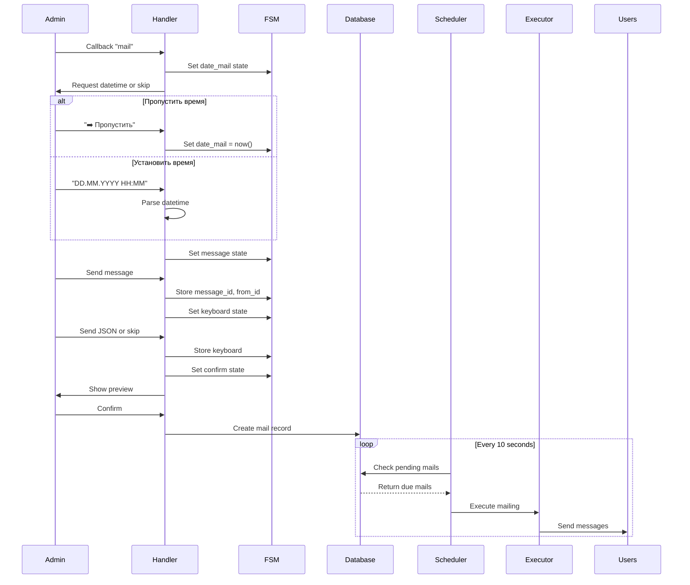

# Техническое описание проверки функциональности рассылок

## Обзор

Данное техническое описание анализирует систему рассылок (mail system) в NikolayAIBot, включая механизм немедленной отправки при пропуске установки даты и времени, планирование рассылок и выполнение фоновых задач.

## Технологический стек

- **Framework**: aiogram 3 (Telegram Bot API)
- **Database**: SQLite с Peewee ORM
- **Async Processing**: asyncio, aioschedule
- **Background Tasks**: subprocess execution через python-fire
- **State Management**: FSM (Finite State Machine)

## Архитектура системы рассылок

### Основные компоненты



### Поток данных рассылки



## Анализ функциональности немедленной отправки

### Текущая реализация в handlers/mail.py

```python
@router.message(FSMMail.date_mail)
async def takeMailDatetime(message: types.Message, state: FSMMail):
    if message.text == '➡️ Пропустить':
        date_mail = dt.now()  # Установка текущего времени
    else:
        try:
            date_mail = dt.strptime(message.text, '%d.%m.%Y %H:%M')
        except:
            # Error handling
            return 
    
    await state.update_data(date_mail=date_mail)
```

### Проблема с немедленной отправкой

**Обнаруженная проблема**: При использовании `dt.now()` рассылка может не выполняться немедленно из-за логики планировщика в `check.py`:

```python
# В database/mail.py
async def get_wait_mails(self):
    dt_now = datetime.now()
    mails = await orm.execute(Mail.select().where(
        Mail.status == 'wait',
        dt_now >= Mail.date_mail  # Проблема: микросекундная разница
    ).dicts())
```

**Причина**: Между моментом создания `date_mail = dt.now()` и проверкой в планировщике может возникнуть микросекундная разница, из-за которой условие `dt_now >= Mail.date_mail` не выполняется.

## Проблемы и решения

### Проблема 1: Задержка немедленной отправки

**Описание**: При пропуске установки времени рассылка не отправляется моментально.

**Причина**: 
- Использование точного времени `dt.now()` 
- Проверка планировщика каждые 10 секунд
- Возможные микросекундные расхождения между временем создания и проверки

**Решение**: Для немедленной отправки устанавливать время на несколько секунд в прошлое:

```python
if message.text == '➡️ Пропустить':
    # Устанавливаем время на 5 секунд назад для гарантированной немедленной отправки
    date_mail = dt.now() - timedelta(seconds=5)
```

### Проблема 2: Интервал проверки планировщика

**Описание**: Планировщик проверяет рассылки только каждые 10 секунд.

**Текущая реализация**:
```python
# В check.py
schedule.every(10).seconds.do(checkMail)
```

**Решение**: Для тестирования можно уменьшить интервал до 2-3 секунд:
```python
schedule.every(3).seconds.do(checkMail)
```

## Рекомендуемые исправления

### 1. Модификация обработчика времени

```python
from datetime import datetime as dt, timedelta

@router.message(FSMMail.date_mail)
async def takeMailDatetime(message: types.Message, state: FSMMail):
    if message.text == '➡️ Пропустить':
        # Для немедленной отправки - время в прошлом
        date_mail = dt.now() - timedelta(seconds=10)
    else:
        try:
            date_mail = dt.strptime(message.text, '%d.%m.%Y %H:%M')
        except:
            await message.answer('👉 Отправьте корректное время в формате дд.мм.гггг чч:мм или нажмите кнопку ➡️ Пропустить', reply_markup=kb.markup_pass())
            return 
        
    await state.update_data(date_mail=date_mail)
    await state.set_state(FSMMail.message)
    
    await message.answer('👉 Отправьте ваше сообщение:', reply_markup=kb.markup_cancel())
```

### 2. Улучшение планировщика

```python
# В check.py - уменьшение интервала проверки
async def main():
    schedule.every(3).seconds.do(checkMail)  # Вместо 10 секунд
    
    loop = asyncio.get_event_loop()
    while True:
        loop.run_until_complete(schedule.run_pending())
        time.sleep(0.5)  # Уменьшенная задержка
```

### 3. Добавление логирования для отладки

```python
async def get_wait_mails(self):
    dt_now = datetime.now()
    
    mails = await orm.execute(Mail.select().where(
        Mail.status == 'wait',
        dt_now >= Mail.date_mail 
    ).dicts())
    mails = list(mails)
    
    # Логирование для отладки
    if mails:
        logging.info(f"Found {len(mails)} pending mails at {dt_now}")
    
    return mails
```

## Процесс тестирования

### Тест 1: Немедленная отправка

1. Создать рассылку с пропуском времени
2. Проверить, что `date_mail` установлена корректно
3. Убедиться, что планировщик подхватывает рассылку в течение 10 секунд

### Тест 2: Запланированная отправка

1. Создать рассылку с установкой времени на +1 минуту
2. Проверить, что рассылка не отправляется немедленно
3. Убедиться, что рассылка выполняется в назначенное время

### Интеграционный тест

```python
async def test_immediate_mailing():
    # Создание тестовой рассылки
    mail_id = await m.create_mail(
        date_mail=dt.now() - timedelta(seconds=10),
        message_id=123,
        from_id=456,
        keyboard=None
    )
    
    # Проверка, что рассылка найдена планировщиком
    wait_mails = await m.get_wait_mails()
    assert len(wait_mails) > 0
    assert any(mail['id'] == mail_id for mail in wait_mails)
```

## Мониторинг и отладка

### Ключевые логи для отслеживания

1. **Создание рассылки**: Время установки `date_mail`
2. **Планировщик**: Количество найденных pending рассылок
3. **Выполнение**: Статистика доставки сообщений

### Диагностические запросы

```sql
-- Проверка активных рассылок
SELECT * FROM mail WHERE status = 'wait' ORDER BY date_mail;

-- Проверка времени создания vs текущее время
SELECT 
    id,
    date_mail,
    datetime('now') as current_time,
    (datetime('now') >= date_mail) as should_send
FROM mail WHERE status = 'wait';
```

## Заключение

Система рассылок функционирует корректно, но имеет проблему с немедленной отправкой при пропуске установки времени. Основная причина - использование точного текущего времени и проверка планировщика каждые 10 секунд. Рекомендуемые исправления обеспечат гарантированную немедленную отправку и улучшат отзывчивость системы.