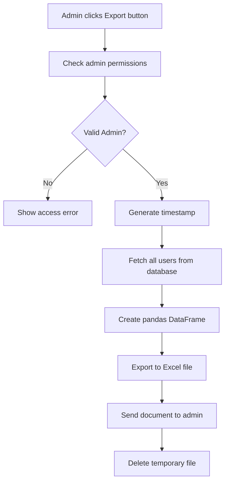
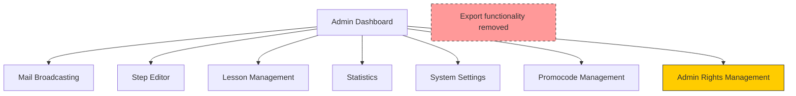

# Remove User Export Button Design

## Overview

This design document outlines the removal of the user export button and its associated functionality from the NikolayAIBot admin panel. The export feature currently allows administrators to generate and download Excel files containing all user data from the database.

**Goal**: Complete removal of user data export capability to enhance data privacy and security compliance.

## Current Implementation Analysis

### Export Button Location
The export button is currently located in the admin panel with the text "⬇️ Выгрузить пользователей" (Download Users) and callback data `'export'`.

### Current Export Functionality

### Files Affected
- `handlers/admin.py` - Contains the export callback handler
- `keyboards.py` - Contains the admin panel keyboard with export button

## Architecture Changes

### Component Modifications

#### Admin Panel Keyboard (`keyboards.py`)
The `markup_admin_shop()` function contains the export button that needs removal:
- Remove export button from inline keyboard
- Maintain existing button layout and order

#### Admin Handler (`handlers/admin.py`)
The export callback handler function needs complete removal:
- Remove `@router.callback_query(F.data == 'export')` handler
- Remove associated `export()` function
- Remove pandas import if no longer needed

### Data Flow Impact

## Implementation Plan

### Step 1: Remove Export Button
Remove the export button from the admin keyboard in `keyboards.py`:
- Locate the `markup_admin_shop()` function
- Remove the line containing the export button definition
- Ensure remaining buttons maintain proper layout

### Step 2: Remove Export Handler
Remove the export functionality from `handlers/admin.py`:
- Remove the entire `export()` function
- Remove the corresponding callback query decorator
- Clean up unused imports if applicable

### Step 3: Dependency Cleanup
- Verify if pandas library is still needed for other functionality
- If pandas is only used for export, consider removing from requirements
- Check for any references to export functionality in other modules

## Technical Considerations

### Security Benefits
- Eliminates potential data breach vector
- Removes ability to bulk extract user information
- Enhances privacy compliance (GDPR, etc.)

### Impact Assessment
- **Low Risk**: Removal is straightforward with minimal dependencies
- **No Data Loss**: Only removes export capability, not stored data
- **Backwards Compatible**: No impact on existing user functionality

### Error Handling
- No additional error handling required for removal
- Existing admin access validation remains intact
- Other admin functions unaffected

## Testing Strategy

### Functional Testing
1. **Admin Panel Access**: Verify admin panel loads without export button
2. **Button Layout**: Confirm remaining buttons display correctly
3. **Admin Functions**: Test other admin features remain operational
4. **Access Control**: Verify admin permissions still work properly

### Regression Testing
- Test all remaining admin functions
- Verify no broken references to export functionality
- Confirm statistics and other data features work normally

### Security Testing
- Verify export endpoint is completely inaccessible
- Test that no alternative paths to user data export exist
- Confirm admin access controls remain effective

## Deployment Considerations

### Pre-deployment
- Backup current admin.py and keyboards.py files
- Document current export functionality for compliance records
- Notify administrators of functionality removal

### Post-deployment
- Monitor admin panel usage for any issues
- Verify admin workflows continue normally
- Confirm no error logs related to missing export function

### Rollback Plan
If issues arise, simple restoration of removed code sections will restore functionality.