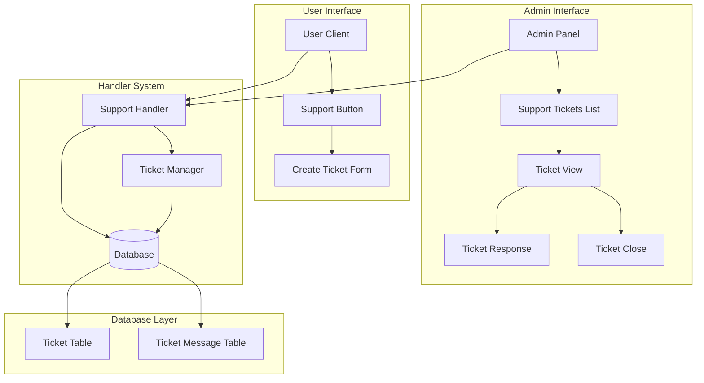
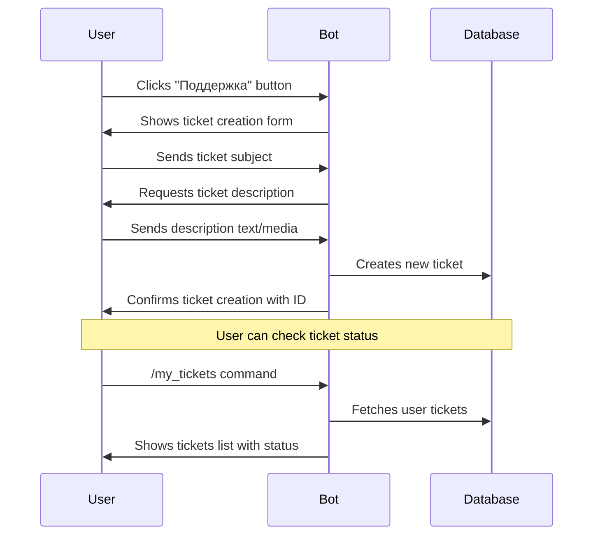
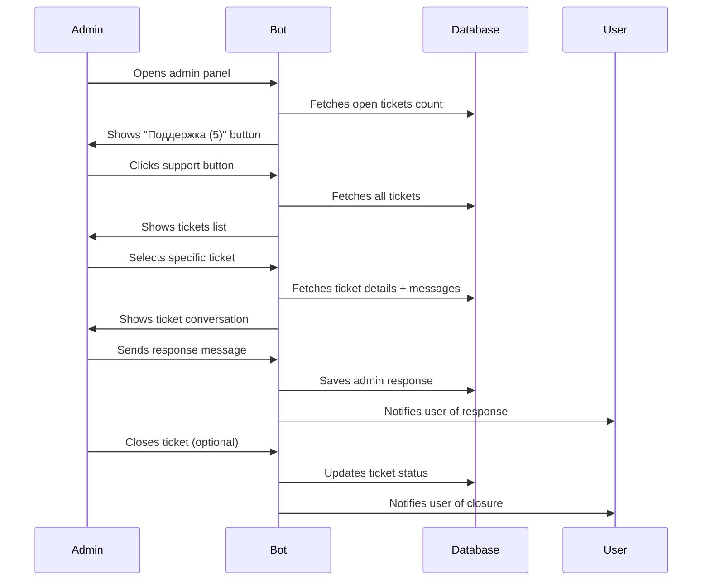

# Support Ticket System Design

## Overview

This document outlines the design for implementing a support ticket system for the NikolayAIBot Telegram bot. The system will allow users to create support tickets when they need help, and enable administrators to respond, manage, and close these tickets through the admin panel.

## Architecture

### Core Components


```mermaid
graph TB
    subgraph "User Interface"
        UC[User Client] --> SB[Support Button]
        SB --> CT[Create Ticket Form]
    end
    
    subgraph "Admin Interface"
        AP[Admin Panel] --> STL[Support Tickets List]
        STL --> TV[Ticket View]
        TV --> TR[Ticket Response]
        TV --> TC[Ticket Close]
    end
    
    subgraph "Handler System"
        SH[Support Handler] --> DB[(Database)]
        SH --> TM[Ticket Manager]
    end
    
    subgraph "Database Layer"
        DB --> TT[Ticket Table]
        DB --> TMT[Ticket Message Table]
    end
    
    UC --> SH
    AP --> SH
    TM --> DB
```

### Database Schema

#### Support Ticket Table
```sql
CREATE TABLE support_ticket (
    id INTEGER PRIMARY KEY AUTOINCREMENT,
    user_id BIGINT NOT NULL,
    subject TEXT NOT NULL,
    description TEXT NOT NULL,
    status VARCHAR(20) DEFAULT 'open',  -- open, in_progress, closed
    priority VARCHAR(10) DEFAULT 'normal',  -- low, normal, high, urgent
    category VARCHAR(50) DEFAULT 'general',  -- general, payment, technical, etc
    assigned_admin_id BIGINT NULL,
    created_at DATETIME DEFAULT CURRENT_TIMESTAMP,
    updated_at DATETIME DEFAULT CURRENT_TIMESTAMP,
    closed_at DATETIME NULL
);
```

#### Ticket Messages Table
```sql
CREATE TABLE ticket_message (
    id INTEGER PRIMARY KEY AUTOINCREMENT,
    ticket_id INTEGER NOT NULL,
    sender_id BIGINT NOT NULL,
    sender_type VARCHAR(10) NOT NULL,  -- 'user' or 'admin'
    message_text TEXT NOT NULL,
    message_type VARCHAR(20) DEFAULT 'text',  -- text, photo, document, etc
    file_id TEXT NULL,  -- Telegram file_id for media
    created_at DATETIME DEFAULT CURRENT_TIMESTAMP,
    FOREIGN KEY (ticket_id) REFERENCES support_ticket(id)
);
```

## User Interface Flow

### User Support Flow


```mermaid
sequenceDiagram
    participant U as User
    participant B as Bot
    participant DB as Database
    
    U->>B: Clicks "Поддержка" button
    B->>U: Shows ticket creation form
    U->>B: Sends ticket subject
    B->>U: Requests ticket description
    U->>B: Sends description text/media
    B->>DB: Creates new ticket
    B->>U: Confirms ticket creation with ID
    
    Note over U,DB: User can check ticket status
    U->>B: /my_tickets command
    B->>DB: Fetches user tickets
    B->>U: Shows tickets list with status
```

### Admin Support Flow


```mermaid
sequenceDiagram
    participant A as Admin
    participant B as Bot
    participant DB as Database
    participant U as User
    
    A->>B: Opens admin panel
    B->>DB: Fetches open tickets count
    B->>A: Shows "Поддержка (5)" button
    A->>B: Clicks support button
    B->>DB: Fetches all tickets
    B->>A: Shows tickets list
    A->>B: Selects specific ticket
    B->>DB: Fetches ticket details + messages
    B->>A: Shows ticket conversation
    A->>B: Sends response message
    B->>DB: Saves admin response
    B->>U: Notifies user of response
    A->>B: Closes ticket (optional)
    B->>DB: Updates ticket status
    B->>U: Notifies user of closure
```

## Technical Implementation

### State Management

New FSM states for support system:
```python
class FSMSupport(StatesGroup):
    waiting_subject = State()
    waiting_description = State()
    waiting_response = State()
```

### Handler Structure

#### User Support Handlers
- `@router.callback_query(F.data == 'support')` - Show support options
- `@router.callback_query(F.data == 'create_ticket')` - Start ticket creation
- `@router.message(FSMSupport.waiting_subject)` - Process ticket subject
- `@router.message(FSMSupport.waiting_description)` - Process ticket description
- `@router.callback_query(F.data.startswith('view_ticket:'))` - View ticket details
- `@router.message(Command('my_tickets'))` - Show user's tickets

#### Admin Support Handlers
- `@router.callback_query(F.data == 'admin_support')` - Show tickets dashboard
- `@router.callback_query(F.data.startswith('ticket:'))` - View specific ticket
- `@router.callback_query(F.data.startswith('respond_ticket:'))` - Respond to ticket
- `@router.callback_query(F.data.startswith('close_ticket:'))` - Close ticket
- `@router.callback_query(F.data.startswith('assign_ticket:'))` - Assign ticket to admin

### Database Models

#### SupportTicket Model
```python
class SupportTicket(peewee.Model):
    user_id = peewee.BigIntegerField()
    subject = peewee.TextField()
    description = peewee.TextField()
    status = peewee.CharField(max_length=20, default='open')
    priority = peewee.CharField(max_length=10, default='normal')
    category = peewee.CharField(max_length=50, default='general')
    assigned_admin_id = peewee.BigIntegerField(null=True)
    created_at = peewee.DateTimeField(default=datetime.now)
    updated_at = peewee.DateTimeField(default=datetime.now)
    closed_at = peewee.DateTimeField(null=True)
    
    class Meta:
        database = con
```

#### TicketMessage Model
```python
class TicketMessage(peewee.Model):
    ticket_id = peewee.ForeignKeyField(SupportTicket, backref='messages')
    sender_id = peewee.BigIntegerField()
    sender_type = peewee.CharField(max_length=10)  # 'user' or 'admin'
    message_text = peewee.TextField()
    message_type = peewee.CharField(max_length=20, default='text')
    file_id = peewee.TextField(null=True)
    created_at = peewee.DateTimeField(default=datetime.now)
    
    class Meta:
        database = con
```

## User Interface Components

### Keyboard Layouts

#### User Support Menu
```python
def markup_support_menu():
    items = [
        [InlineKeyboardButton(text="🎫 Создать тикет", callback_data='create_ticket')],
        [InlineKeyboardButton(text="📋 Мои тикеты", callback_data='my_tickets')],
        [InlineKeyboardButton(text="◀️ Назад", callback_data='back_main')]
    ]
    return InlineKeyboardMarkup(inline_keyboard=items)
```

#### Admin Support Dashboard
```python
def markup_admin_support():
    items = [
        [InlineKeyboardButton(text="🟢 Открытые тикеты", callback_data='tickets_open')],
        [InlineKeyboardButton(text="🟡 В работе", callback_data='tickets_in_progress')],
        [InlineKeyboardButton(text="🔴 Закрытые тикеты", callback_data='tickets_closed')],
        [InlineKeyboardButton(text="📊 Статистика", callback_data='support_stats')],
        [InlineKeyboardButton(text="◀️ Назад в админку", callback_data='backAdmin')]
    ]
    return InlineKeyboardMarkup(inline_keyboard=items)
```

#### Ticket Management Buttons
```python
def markup_ticket_actions(ticket_id, is_closed=False):
    items = []
    
    if not is_closed:
        items.extend([
            [InlineKeyboardButton(text="💬 Ответить", callback_data=f'respond_ticket:{ticket_id}')],
            [InlineKeyboardButton(text="✅ Закрыть тикет", callback_data=f'close_ticket:{ticket_id}')],
            [InlineKeyboardButton(text="🔄 Изменить статус", callback_data=f'change_status:{ticket_id}')]
        ])
    
    items.append([InlineKeyboardButton(text="◀️ К списку тикетов", callback_data='admin_support')])
    
    return InlineKeyboardMarkup(inline_keyboard=items)
```

## Business Logic

### Ticket Creation Process
1. User clicks "Поддержка" button
2. System shows support menu with "Создать тикет" option
3. User enters ticket subject (title)
4. User provides detailed description with optional media
5. System creates ticket record in database
6. User receives confirmation with ticket ID
7. Admins receive notification about new ticket

### Ticket Response Process
1. Admin views ticket in support dashboard
2. Admin reads ticket conversation history
3. Admin composes response message
4. System saves admin response to database
5. User receives notification about new response
6. Ticket status updated to "in_progress" if it was "open"

### Notification System
- Users receive notifications when:
  - Admin responds to their ticket
  - Ticket status changes
  - Ticket is closed
- Admins receive notifications when:
  - New ticket is created
  - User responds to existing ticket

## Security Considerations

### Access Control
- Only ticket creator can view their own tickets
- Admins can view all tickets
- Only admins can respond and manage tickets
- Validate user permissions before any ticket operations

### Data Validation
- Sanitize all user input before database storage
- Limit ticket subject length (max 200 characters)
- Limit description length (max 4000 characters)
- Validate file uploads for security

### Rate Limiting
- Limit ticket creation to prevent spam (max 5 tickets per user per day)
- Implement cooldown between consecutive ticket creations (5 minutes)

## Integration Points

### Existing System Integration
- Extend `keyboards.py` with new support-related keyboards
- Add support handlers to main handler registration in `nikolayai.py`
- Update admin panel in `handlers/admin.py` to include support button
- Modify user interface in `handlers/client.py` and `handlers/shop.py`

### Database Integration
- Add new models to `database/sql.py` for table creation
- Create migration script for existing installations
- Update database initialization in main application

## Error Handling

### Common Error Scenarios
- Database connection failures during ticket operations
- Invalid ticket IDs in callback queries
- Permission denied for unauthorized access attempts
- File upload failures for media attachments

### Error Recovery
- Graceful degradation when database is unavailable
- Clear error messages for users
- Logging of all errors for admin monitoring
- Retry mechanisms for temporary failures

## Testing Strategy

### Unit Tests
- Test ticket creation with various input types
- Test admin response functionality
- Test ticket status updates and transitions
- Test permission validation

### Integration Tests
- Test complete user ticket creation flow
- Test admin ticket management workflow
- Test notification delivery system
- Test database transaction consistency