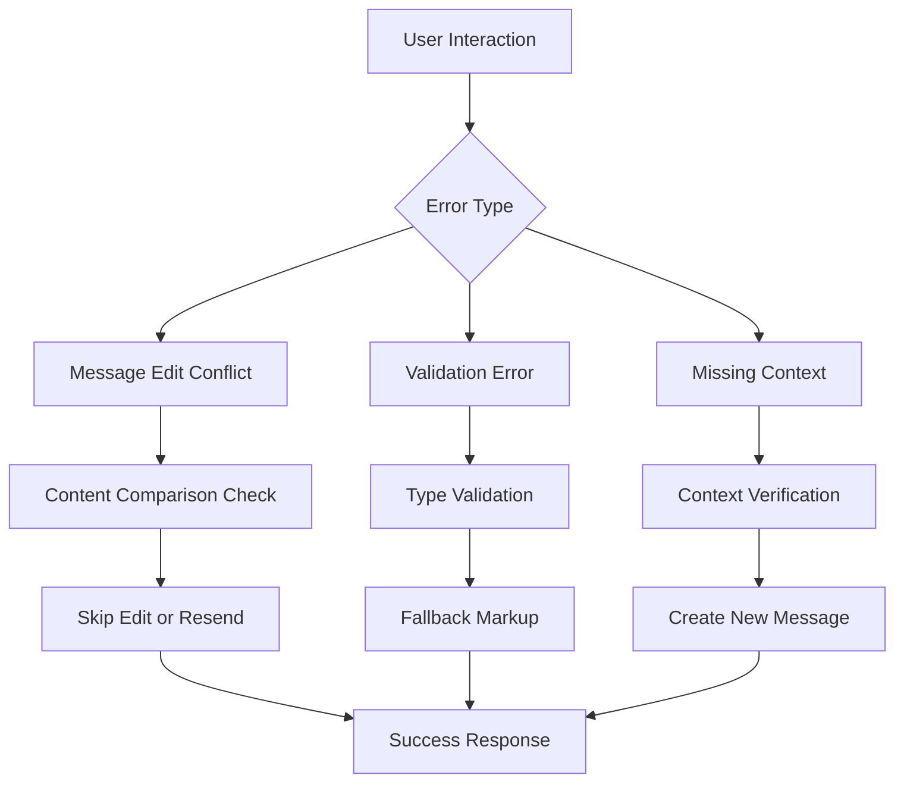
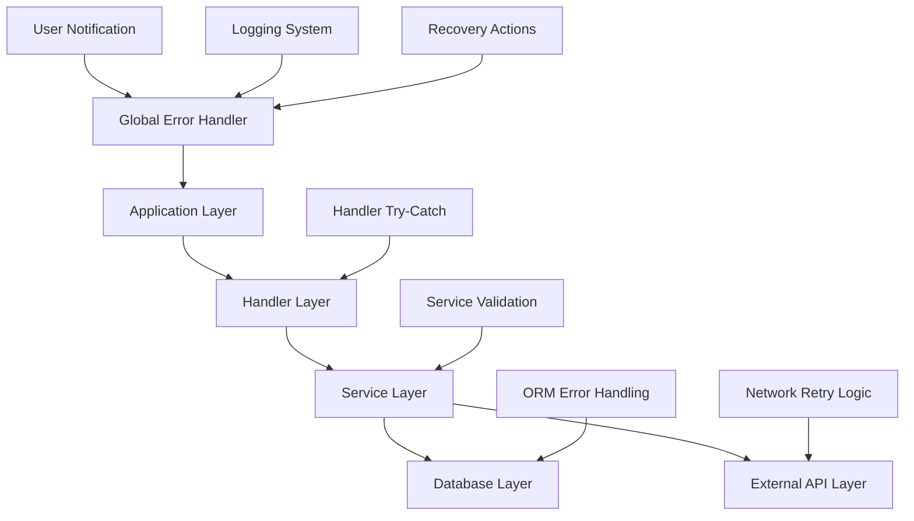
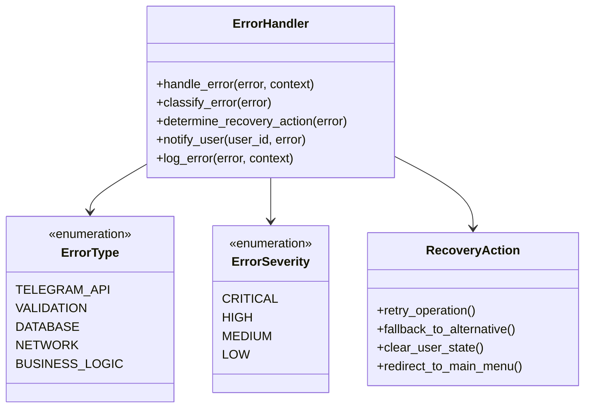
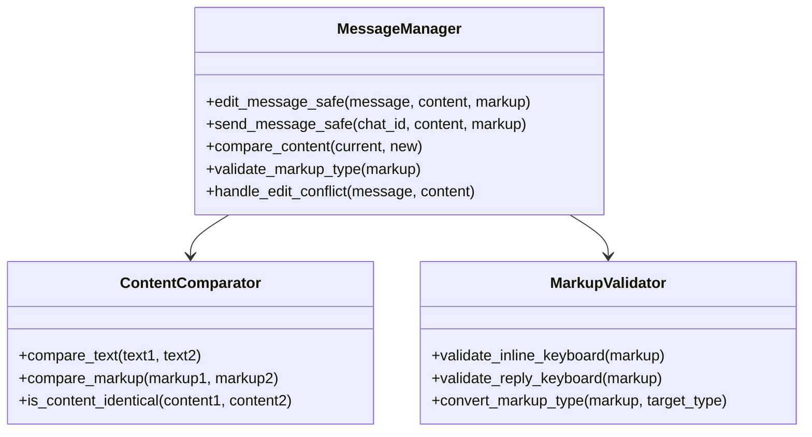
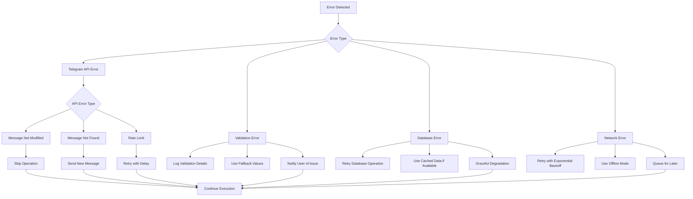
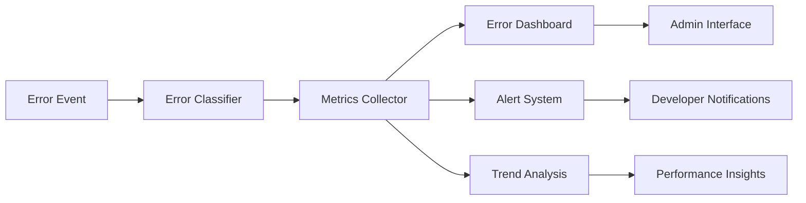
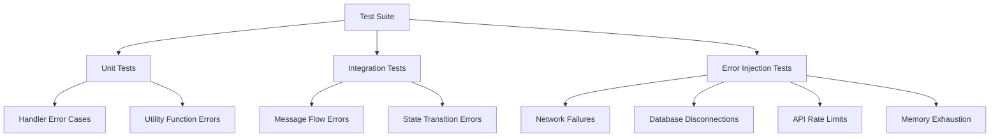

# Telegram Bot Error Handling Design

## Overview
This design addresses critical error handling improvements for the NikolayAI Telegram bot to ensure robust operation and better user experience. The current implementation shows several error patterns that need systematic resolution.

## Error Analysis

### Current Error Patterns
Based on the runtime logs, three main categories of errors are identified:

1. **Message Editing Conflicts**: "message is not modified" errors when attempting to edit messages with identical content
2. **Validation Errors**: Pydantic validation failures when incorrect markup types are used
3. **Missing Message Context**: "message to edit not found" errors when references become stale



## Architecture

### Error Handler Hierarchy
The error handling system follows a layered approach:



### Core Components

#### 1. Error Classification System


#### 2. Message Management System


## Implementation Strategy

### 1. Safe Message Editing
Implement content comparison before editing to prevent "message not modified" errors:

```python
async def edit_message_safe(message, new_text, new_markup=None):
    """Safely edit message with content comparison"""
    try:
        # Compare current content with new content
        if is_content_identical(message.text, new_text, message.reply_markup, new_markup):
            # Content is identical, skip edit
            return True
            
        # Proceed with edit
        await message.edit_text(new_text, reply_markup=new_markup)
        return True
        
    except TelegramBadRequest as e:
        if "message is not modified" in str(e):
            # Content was identical but comparison missed it
            return True
        elif "message to edit not found" in str(e):
            # Message was deleted, send new message
            await message.answer(new_text, reply_markup=new_markup)
            return True
        else:
            # Other Telegram API error
            raise
    except Exception as e:
        # Unexpected error
        logging.error(f"Unexpected error in edit_message_safe: {e}")
        raise
```

### 2. Markup Type Validation
Prevent validation errors by ensuring correct markup types:

```python
def validate_and_convert_markup(markup, context="inline"):
    """Validate and convert markup to appropriate type"""
    if markup is None:
        return None
        
    if context == "inline":
        if isinstance(markup, ReplyKeyboardMarkup):
            # Convert or provide fallback
            logging.warning("ReplyKeyboardMarkup used in inline context, converting to InlineKeyboardMarkup")
            return InlineKeyboardMarkup(inline_keyboard=[[]])
        elif isinstance(markup, InlineKeyboardMarkup):
            return markup
    elif context == "reply":
        if isinstance(markup, InlineKeyboardMarkup):
            logging.warning("InlineKeyboardMarkup used in reply context, converting to ReplyKeyboardMarkup")
            return ReplyKeyboardMarkup(keyboard=[[]], resize_keyboard=True)
        elif isinstance(markup, ReplyKeyboardMarkup):
            return markup
            
    return markup
```

### 3. Error Recovery Actions


### 4. State Management Error Handling
Enhanced state management to prevent corruption:

```python
async def safe_state_operation(state: FSMContext, operation, **kwargs):
    """Safely perform state operations with error handling"""
    try:
        if operation == "set":
            await state.set_state(kwargs['new_state'])
        elif operation == "update":
            await state.update_data(**kwargs['data'])
        elif operation == "clear":
            await state.clear()
        elif operation == "get":
            return await state.get_data()
            
    except Exception as e:
        logging.error(f"State operation failed: {operation}, error: {e}")
        # Clear corrupted state
        try:
            await state.clear()
        except:
            pass
        # Provide default state
        if operation == "get":
            return {}
        raise StateCorruptionError(f"State operation {operation} failed")
```

## Error Monitoring & Logging

### Enhanced Logging Structure
```python
class ErrorLogger:
    def __init__(self):
        self.setup_loggers()
    
    def log_error(self, error, context):
        """Log error with structured format"""
        log_data = {
            'timestamp': datetime.now().isoformat(),
            'error_type': type(error).__name__,
            'error_message': str(error),
            'user_id': context.get('user_id'),
            'handler': context.get('handler'),
            'callback_data': context.get('callback_data'),
            'state': context.get('current_state'),
            'stack_trace': traceback.format_exc()
        }
        
        logging.error(json.dumps(log_data, ensure_ascii=False))
        
        # Send to monitoring system if configured
        if self.monitoring_enabled:
            self.send_to_monitoring(log_data)
```

### Error Metrics Collection
Track error patterns for improvement:



## Handler-Specific Improvements

### Shop Handler Enhancements
Address specific errors found in shop.py:

1. **Promocode Handler Fix**:
   - Validate markup type before passing to edit_text
   - Add content comparison to prevent duplicate edits
   - Implement proper error recovery

2. **Lesson Details Handler Fix**:
   - Add message existence validation
   - Implement fallback message creation
   - Handle stale message references

3. **Purchase Flow Resilience**:
   - Add transaction rollback on errors
   - Implement purchase verification
   - Handle payment gateway timeouts

### Database Operation Resilience
```python
async def resilient_database_operation(operation, *args, **kwargs):
    """Execute database operation with retry and error handling"""
    max_retries = 3
    retry_delay = 1.0
    
    for attempt in range(max_retries):
        try:
            return await operation(*args, **kwargs)
        except DatabaseConnectionError as e:
            if attempt < max_retries - 1:
                await asyncio.sleep(retry_delay * (2 ** attempt))
                continue
            else:
                logging.error(f"Database operation failed after {max_retries} attempts: {e}")
                raise
        except Exception as e:
            logging.error(f"Unexpected database error: {e}")
            raise
```

## Testing Strategy

### Error Injection Testing


### Test Implementation Framework
```python
class ErrorHandlingTestSuite:
    async def test_message_edit_conflict(self):
        """Test handling of message edit conflicts"""
        # Simulate identical content edit attempt
        # Verify no exception is raised
        # Verify operation completes successfully
        
    async def test_validation_error_recovery(self):
        """Test recovery from validation errors"""
        # Pass invalid markup type
        # Verify fallback mechanism activates
        # Verify user receives appropriate response
        
    async def test_state_corruption_recovery(self):
        """Test recovery from corrupted state"""
        # Simulate state corruption
        # Verify state is cleared
        # Verify user is guided to recovery path
```

## Performance Considerations

### Resource Management
- Implement connection pooling for database operations
- Add request rate limiting to prevent API quota exhaustion
- Use message queuing for high-volume error scenarios
- Implement graceful degradation under high load

### Memory Optimization
- Clear large objects from memory after error handling
- Implement garbage collection triggers after error bursts
- Monitor memory usage patterns during error scenarios

## Deployment & Monitoring

### Error Alert Configuration
```yaml
error_alerts:
  critical_errors:
    - DatabaseConnectionFailure
    - PaymentProcessingError
    - AuthenticationFailure
  
  notification_channels:
    - telegram_admin_group
    - email_alerts
    - webhook_endpoints
    
  thresholds:
    error_rate: 10_per_minute
    consecutive_failures: 5
    user_impact_threshold: 100_users
```

### Health Check Integration
```python
class BotHealthChecker:
    async def check_handler_health(self):
        """Check if handlers are responding correctly"""
        
    async def check_database_health(self):
        """Verify database connectivity and performance"""
        
    async def check_telegram_api_health(self):
        """Test Telegram API connectivity"""
        
    async def generate_health_report(self):
        """Generate comprehensive health status"""
```

## Migration Strategy

### Phase 1: Critical Error Fixes (Week 1)
- Implement safe message editing
- Fix markup validation errors
- Add basic error recovery

### Phase 2: Enhanced Error Handling (Week 2)
- Deploy comprehensive error classification
- Implement monitoring and alerting
- Add database resilience

### Phase 3: Advanced Features (Week 3)
- Deploy error analytics
- Implement predictive error prevention
- Add performance optimization

### Phase 4: Testing & Validation (Week 4)
- Comprehensive error injection testing
- Performance benchmarking
- Documentation and training