# Router Conflict Resolution and System Improvements Design

## Overview

This design addresses the critical router conflict issue identified in the testing report where the `/start` command shows the main menu instead of the onboarding flow. The root cause is incorrect router registration order in `nikolayai.py`, where `shop.shop_router` is registered before `client.router`, causing the shop's start handler to override the client's onboarding start handler.

## Architecture

### Current Router Registration Issue

```mermaid
graph TD
    A["/start Command"] --> B{Router Priority Order}
    B --> C[shop.shop_router - FIRST]
    B --> D[admin.router - SECOND]
    B --> E[mail.router - THIRD]  
    B --> F[client.router - LAST]
    C --> G[start_shop() Handler]
    F --> H[start() Handler - NEVER REACHED]
    G --> I[Shows Main Menu ❌]
    H --> J[Shows Onboarding ✅]
    
    style C fill:#ffcccc
    style G fill:#ffcccc
    style I fill:#ffcccc
```

### Target Router Registration Order

```mermaid
graph TD
    A["/start Command"] --> B{Corrected Router Priority}
    B --> C[client.router - FIRST]
    B --> D[shop.shop_router - SECOND]
    B --> E[admin.router - THIRD]
    B --> F[mail.router - FOURTH]
    C --> G[start() Handler - Onboarding Logic]
    D --> H[shop handlers - Callback Only]
    G --> I{User Onboarding Complete?}
    I --> J[Yes: Show Main Menu]
    I --> K[No: Start Onboarding Steps]
    
    style C fill:#ccffcc
    style G fill:#ccffcc
    style J fill:#ccffcc
    style K fill:#ccffcc
```

## Router Conflict Resolution

### Solution 1: Correct Router Registration Order

**Primary Recommendation**: Reorder router registration in `nikolayai.py` to prioritize onboarding flow.

```python
# Current problematic order (lines 32-36)
dp.include_router(payment.payment_router)  
dp.include_router(support.router)          
dp.include_router(shop.shop_router)        # ❌ Overrides client /start
dp.include_router(admin.router)            
dp.include_router(mail.router)             
dp.include_router(client.router)           # ❌ Never reached for /start

# Corrected order
dp.include_router(payment.payment_router)  
dp.include_router(support.router)          
dp.include_router(client.router)           # ✅ Handles /start first
dp.include_router(admin.router)            
dp.include_router(mail.router)             
dp.include_router(shop.shop_router)        # ✅ Handles shop callbacks only
```

### Solution 2: Remove CommandStart from Shop Handler

**Alternative Approach**: Eliminate the conflicting shop start handler entirely.

| Current Implementation | Improved Implementation |
|----------------------|------------------------|
| `@shop_router.message(CommandStart())` | Remove completely |
| `start_shop()` function | Replace with callback handler |
| Direct `/start` override | Access via "🛒 Shop" button only |

### Solution 3: Conditional Logic in Shop Handler

**Hybrid Approach**: Add onboarding completion check in shop handler.

```python
@shop_router.message(CommandStart())
async def start_shop(message: types.Message, state: FSMContext):
    user_data = await u.get_user(message.from_user.id)
    
    # Check if user needs onboarding
    if user_data is None or not user_data.get('onboarding_completed', False):
        # Skip processing - let client.router handle onboarding
        return
    
    # User has completed onboarding - show shop
    await message.answer(
        utils.get_text('messages.welcome'),
        reply_markup=kb.markup_main_menu()
    )
```

## System Flow Improvements

### Enhanced Onboarding Flow


### Router Priority Matrix

| Handler | Priority | Responsibility | CommandStart Handler |
|---------|----------|---------------|---------------------|
| `payment.payment_router` | 1 | Payment processing | No |
| `support.router` | 2 | User support | No |
| `client.router` | 3 | **User onboarding** | **Yes - Primary** |
| `admin.router` | 4 | Administration | No |
| `mail.router` | 5 | Email functionality | No |
| `shop.shop_router` | 6 | Shop operations | **Remove** |

## Data Models & State Management

### User Onboarding State Tracking


### FSM State Definitions

| State Group | States | Usage |
|-------------|--------|-------|
| `OnboardingStates` | `waiting_phone`, `processing_steps`, `completed` | Track onboarding progress |
| `ShopStates` | `browsing_catalog`, `viewing_lesson`, `processing_payment` | Shop navigation |
| `AdminStates` | `editing_steps`, `managing_users`, `viewing_analytics` | Admin operations |

## Step Editor Validation & Safety

### Data Validation Framework


### Validation Rules

| Field | Validation Rule | Error Message |
|-------|----------------|---------------|
| `content_type` | Must be in: text, photo, video, animation | "Invalid content type" |
| `text` | Required for all types, max 4096 chars | "Text field required" |
| `caption` | Optional, max 1024 chars | "Caption too long" |
| `file_id` | Required for media types | "File ID required for media" |
| `keyboard` | Valid JSON array or null | "Invalid keyboard JSON" |
| `delay` | Integer 0-300 seconds | "Delay must be 0-300 seconds" |

### Audit Logging System

```mermaid
sequenceDiagram
    participant Admin
    participant StepEditor
    participant AuditLogger
    participant Database
    participant BackupSystem
    
    Admin->>StepEditor: Edit step request
    StepEditor->>AuditLogger: log_edit_attempt(admin_id, step_key, action)
    StepEditor->>BackupSystem: create_backup(current_steps)
    StepEditor->>Database: validate_step_data()
    
    alt Validation Success
        Database-->>StepEditor: Valid
        StepEditor->>Database: update_step()
        StepEditor->>AuditLogger: log_edit_success(changes)
        StepEditor->>Admin: ✅ Success message
    else Validation Failed
        Database-->>StepEditor: Invalid
        StepEditor->>AuditLogger: log_edit_failure(errors)
        StepEditor->>Admin: ❌ Error message
    end
```



## Error Handling & Recovery

### Graceful Degradation Strategy

| Error Scenario | Current Behavior | Improved Behavior |
|----------------|------------------|-------------------|
| Invalid step JSON | Bot crash | Show error, load backup |
| Missing step file | Silent failure | Log error, use defaults |
| Database connection lost | Unhandled exception | Retry with fallback |
| Validation failure | No feedback | Clear error message |

### Recovery Mechanisms


## Implementation Roadmap

### Phase 1: Critical Fix (Immediate)
1. **Router Order Correction** - Fix `/start` command conflict
2. **Remove Shop CommandStart** - Eliminate conflicting handler
3. **Add Onboarding Completion Tracking** - Database schema update
4. **Test Router Priority** - Verify fix works correctly

### Phase 2: Enhanced Validation (Short-term)
1. **Step Data Validation** - Implement comprehensive checks
2. **Error Message Improvements** - User-friendly feedback
3. **Backup System** - Automatic step backups before edits
4. **Basic Audit Logging** - Track who changed what

### Phase 3: Advanced Features (Medium-term)
1. **Recovery Mechanisms** - Automatic error recovery
2. **Advanced Logging** - Detailed audit trails
3. **Performance Monitoring** - Track system health
4. **Enhanced Testing** - Automated validation tests

## Testing Strategy

### Unit Tests Coverage

| Component | Test Coverage | Priority |
|-----------|---------------|----------|
| Router registration order | ✅ Required | Critical |
| Start command handling | ✅ Required | Critical |
| Step validation | ✅ Required | High |
| Error recovery | ⚠️ Partial | Medium |
| Audit logging | ❌ Missing | Low |

### Integration Tests

```mermaid
graph LR
    A[User Journey Tests] --> B[/start Command Flow]
    A --> C[Onboarding Completion]
    A --> D[Shop Access After Onboarding]
    
    E[Error Scenario Tests] --> F[Invalid Step Data]
    E --> G[Database Failures]
    E --> H[File Corruption]
    
    I[Admin Workflow Tests] --> J[Step Editing Flow]
    I --> K[Validation Feedback]
    I --> L[Backup/Restore]
```

## Performance Considerations

### Router Optimization

| Optimization | Impact | Implementation |
|--------------|--------|----------------|
| Correct router order | Eliminates unnecessary processing | Reorder registration |
| Remove redundant handlers | Reduces handler conflicts | Remove shop `/start` |
| Optimize callback routing | Faster response times | Use specific filters |

### Memory Management

- **Step Caching**: Cache frequently accessed steps in memory
- **State Cleanup**: Automatic FSM state cleanup after completion
- **Connection Pooling**: Optimize database connection usage

## Security Enhancements

### Input Validation


### Access Control

| User Role | Permissions | Validation |
|-----------|-------------|------------|
| Regular User | Start onboarding, browse shop | User ID verification |
| Admin | Edit steps, manage users | Admin ID whitelist |
| Super Admin | System configuration | Enhanced authentication |